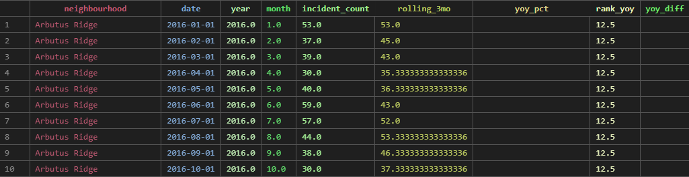
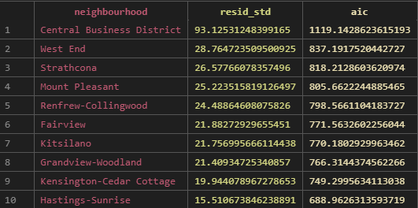
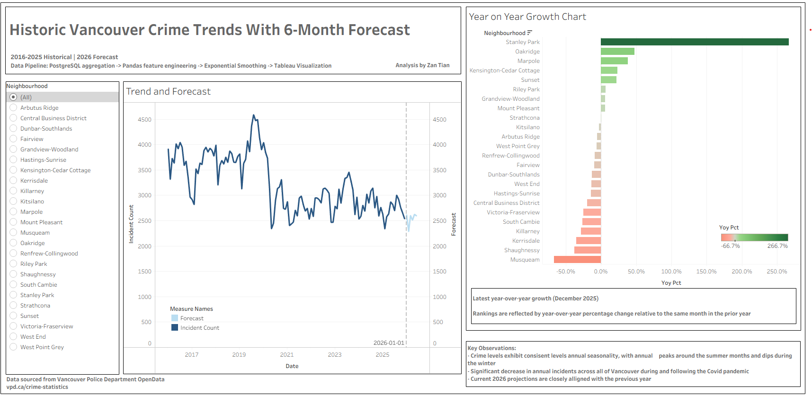
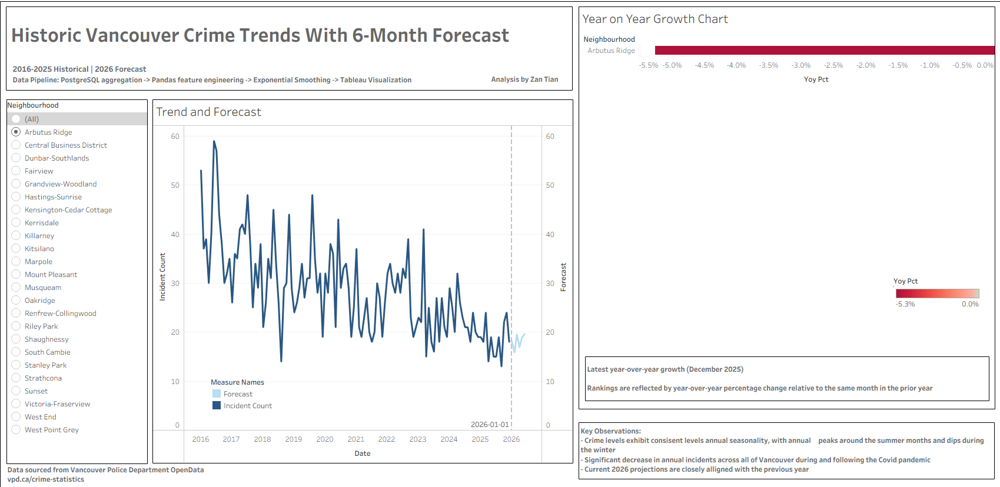

# Historic Vancouver Crime Trends With 6-Month Forecast
**Created with PostgreSQL, Pandas, Time Series Modeling, Tableau Visualization**

### Project Overview
This project builds an end-to-end crime analytics pipeline using data from the Vancouver Police Department for the years 2016-2025 (10 years) in order to:
- Engineer monthly neighbourhood-level panel data
- Compute rolling and year-over-year metrics
- Project the incident rates for the first six months of 2026
- Collect insightful visualizations using an interactive Tableau Dashboard

The goal was to go beyond heat mapping and develop an analysis for the future

### Architecture
PostgreSQL -> Pandas -> Forecasting -> Tableau

1. Raw data ingested into PostgreSQL
2. Aggregated to monthly panel
3. Implemented rolling and year-on-year metrics using Pandas
4. Constructed the balanced panel (24 neighbourhoods x 120 months)
5. Applied Exponential Smoothing (additive, 12-month seasonality)
6. Built an interactive Tableau dashboard to view visualizations with ability to filter by neighbourhood

### Challenges

**Problem 1:** Vancouver Police Department "All years" dataset was missing the year 2022 completely; this caused visualizations to have dips all the way to 0 and affected the predicted projections

**Solution:** Sourced a seperate dataset from VPD that only contained the year 2022 and appended into the original dataset containing the rest of the years. I then rebuilt the aggregation view and re-ran the full feature engineering and forecasting pipeline. The 2022 values then showed perfectly. 

**Problem 2:** A key edge case was that when calculating year-over-year metrics, some times the previous month had cases where there were 0 incident reports. This would create a dividing by zero case and cause the value in the YOY column to be inf.

**Solution:** In cases where the previous year's month had 0 incident reports, the metric to determine year-over-year change would be the difference between the months rather than the percentage. 

### Forecasting Methodology

Used Exponential Smoothing (ETS) with:
- Additive trend
- Additive seasonality
- 12-month seasonal cycle

Since crime incidents exhibited seasonality, ETS can capture without overfitting.

For each neighbourhood:
- Forecasted 6 months ahead
- Computed residual standard deviations
- Generated 95% confidence bounds

### Dashboard Features

1. 10-year Historical Trend Visualization 
2. 6-month 2026 projection
3. Interactive filter based on neighbourhood
4. Latest Year-Over-Year ranking
5. Clean separation of historical vs projection

### Key Observations

- Crime rates exhibit consistent trends based on seasons
- Crime rates drastically changed after the 2020 pandemic and sees exponential drops from the previous year
- Currently, the first 6 months of 2026 closely aligns with the trend of the previous year
- Based on this we can infer that incidents following 2026 will indicate similar behavior

### Access the Interactive UI

https://public.tableau.com/views/HistoricVancouverCrimeTrendsWith6-MonthForecastZan/Dashboard1?:language=en-US&publish=yes&:sid=&:redirect=auth&:display_count=n&:origin=viz_share_link
